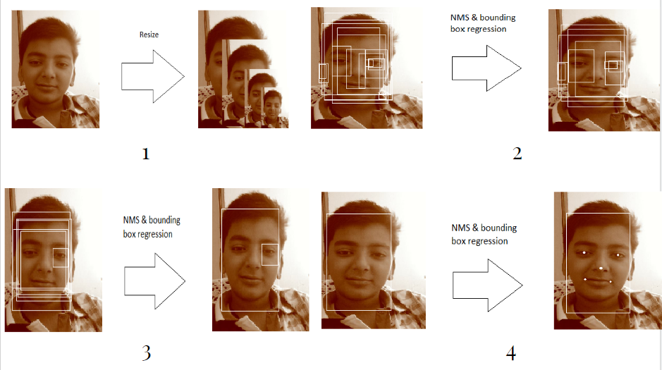
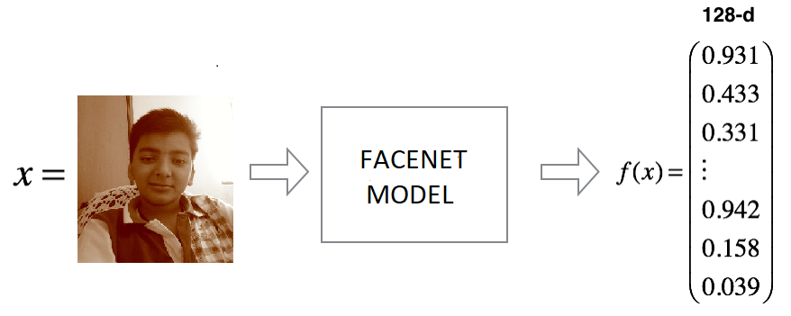
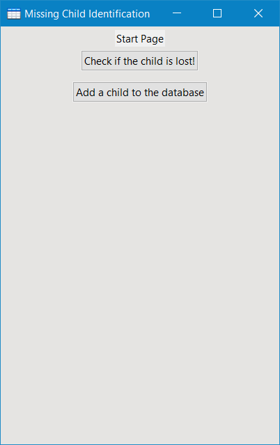
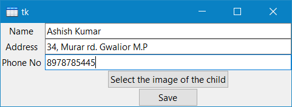
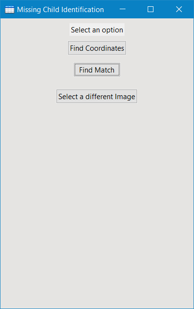
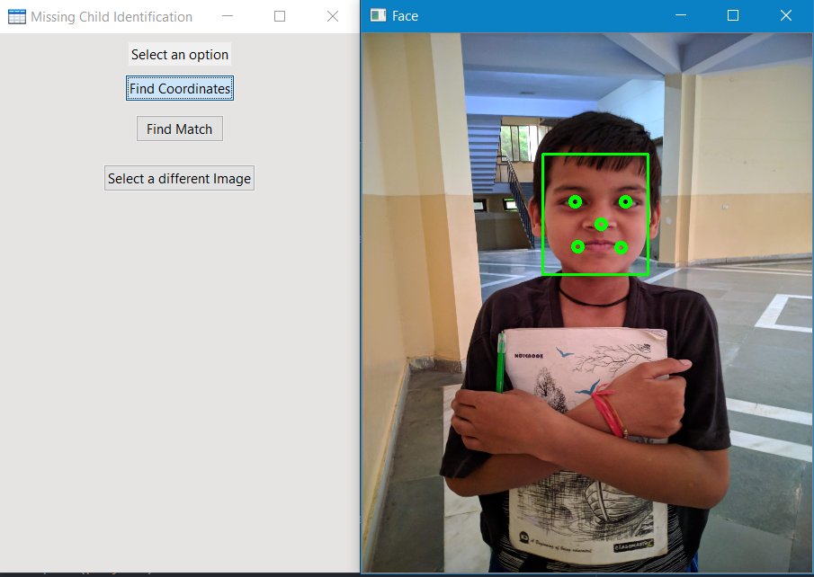

# Missing-Child-Identification-BTP-Thesis
During the Btech thesis project we developed a deep learning model for face recognition using MTCNN algorithm and pre-trained FaceNet model by google and trained the dataset over XGBoost classifier.
The following steps are perfomed by the model:

Step 1: Given an input image the image is resized and the with the help of mtcnn algorithm the bounding boxes are identified and the overlapping boxes are removed with NMS.

Step 2: The facenet Model trained on millions of images gives us a 128D vector which represents a face.

An application using TKinter was made to give the work a UI.

If you want to add a child to the database you can fill the form.

Otherwise if you want to search you get this UI

Then you can find the coordinates as well as other information.

